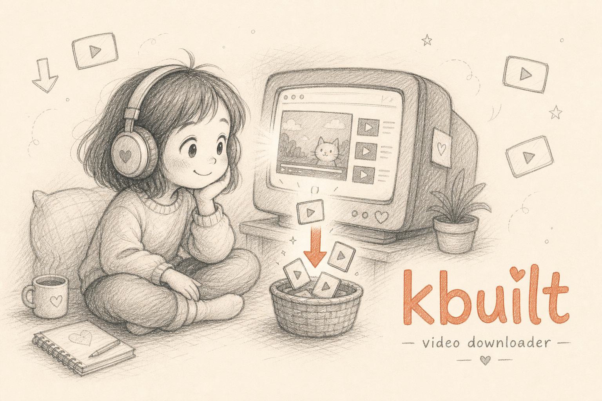

<p align="center">
  
</p>

<p align="center">
  <b>中文</b> ·
  <a href="#english">English</a> ·
  <a href="#日本語">日本語</a> ·
  <a href="#한국어">한국어</a>
</p>

---

## 中文

> 零安装、浏览器即用的高质量视频下载器，带 Claude-Code 终端美学。

打开网址 → 粘贴链接 → 选画质 → 下载。**用户什么都不用装，本地不占任何资源。**

支持 **20+ 站点**：YouTube · Bilibili · 抖音/Douyin · X/Twitter · TikTok · Instagram · Reddit · Twitch · Vimeo · SoundCloud · Tumblr · Pinterest 等。
前端支持 **中 / EN / 日 / 한** 四语切换 + **亮/暗模式**。

### 工作原理

```
  浏览器(你的网站, Vercel)  ──粘贴链接──▶  下载引擎(HF Spaces, 跑 cobalt)
        ▲                                          │
        └──────────  实时把视频流另存到本地  ◀──────┘
              (不缓存任何内容 · 全程云端)
```

- **前端**：终端风格单页站，部署在 **Vercel**（免费）。四语 + 亮暗模式。
- **引擎**：开源的 [imputnet/cobalt](https://github.com/imputnet/cobalt)（yt-dlp+ffmpeg 同级方案，事实标准），自部署在 **Hugging Face Spaces**（免费 Docker）。
- **AI 加成**：Vercel serverless function 调 Claude 做视频摘要、字幕翻译成中文（不碰视频流，省带宽）。

> 我们**不自己造下载逻辑**——YouTube 签名每周变、各站需要不同请求头/cookie，手写必然很快失效。复用 cobalt 这个有全球社区维护的引擎，套自己的皮和 AI 功能，才稳。

### 快速部署

完整步骤见 **[docs/DEPLOY.md](docs/DEPLOY.md)**。两步：

1. **引擎** → HF Spaces 新建 Docker Space，上传 `engine/`，设 `API_URL` 为 Space 自己的地址。
2. **前端** → Vercel 导入本仓库，Root 选 `web/`，设 `NEXT_PUBLIC_ENGINE_URL`（指向引擎）和 `ANTHROPIC_API_KEY`（AI 功能，可选）。

### 实测

已实测 `https://www.youtube.com/watch?v=Y9Wz2PV404E`（"Introducing Claude Fable 5"）：
成功下载 **1080p 视频 + 音频并合并**为可播放 MP4（1920×1080，opus 立体声，1:53）。
注：测试在住宅 IP 完成；HF Spaces 用机房 IP，YouTube 可能需配 cookies，B站/抖音等不受影响。

### YouTube 的诚实说明

YouTube 封机房 IP，而免费云托管都用机房 IP。**B站/抖音/X/TikTok 等稳定可用；YouTube 可能间歇失败**，可给引擎配 cookies 或代理缓解。这是所有免费云下载器的共同限制。

---

## English

> A no-install, browser-based high-quality video downloader with a Claude-Code terminal aesthetic.

Open the site → paste a link → pick quality → download. **Users install nothing; zero local resource use.**

Supports **20+ sites**: YouTube · Bilibili · Douyin · X/Twitter · TikTok · Instagram · Reddit · Twitch · Vimeo · SoundCloud · Tumblr · Pinterest, and more.
The front-end has **中 / EN / 日 / 한** language switching + **light/dark mode**.

### How it works

```
  browser (your site, Vercel)  ──paste link──▶  download engine (HF Spaces, cobalt)
        ▲                                              │
        └──────────  streams the file to your disk  ◀──┘
                  (nothing cached · fully cloud-based)
```

- **Front-end**: terminal-style single page on **Vercel** (free). 4 languages + light/dark.
- **Engine**: open-source [imputnet/cobalt](https://github.com/imputnet/cobalt) (the de-facto standard, yt-dlp+ffmpeg under the hood), self-hosted on **Hugging Face Spaces** (free Docker).
- **AI extras**: Vercel serverless functions call Claude for video summaries and Chinese subtitle translation (never touches the video bytes — bandwidth-safe).

> We **don't reinvent the extraction logic** — YouTube signatures change weekly and each site needs different headers/cookies, so hand-rolled code breaks fast. We reuse cobalt (community-maintained) and put our own skin + AI on top.

### Quick deploy

Full steps in **[docs/DEPLOY.md](docs/DEPLOY.md)**. Two steps:

1. **Engine** → new Docker Space on HF, upload `engine/`, set `API_URL` to the Space's own URL.
2. **Front-end** → import this repo on Vercel, set Root to `web/`, set `NEXT_PUBLIC_ENGINE_URL` (the engine) and `ANTHROPIC_API_KEY` (AI, optional).

### Tested

Verified with `https://www.youtube.com/watch?v=Y9Wz2PV404E` ("Introducing Claude Fable 5"):
successfully downloaded **1080p video + audio merged** into a playable MP4 (1920×1080, opus stereo, 1:53).
Note: tested from a residential IP; HF Spaces uses datacenter IPs, so YouTube may need cookies. Bilibili/Douyin etc. are unaffected.

### Honest note on YouTube

YouTube blocks datacenter IPs, which all free cloud hosts use. **Bilibili/Douyin/X/TikTok work reliably; YouTube may fail intermittently** — mitigate with cookies or a proxy on the engine. This limitation is shared by every free cloud downloader.

---

## 日本語

> インストール不要、ブラウザだけで使える高品質動画ダウンローダー。Claude-Code 風ターミナル UI。

サイトを開く → リンクを貼る → 画質を選ぶ → ダウンロード。**ユーザーは何もインストールせず、ローカル資源も消費しません。**

**20以上のサイト**に対応：YouTube · Bilibili · Douyin · X/Twitter · TikTok · Instagram · Reddit · Twitch · Vimeo · SoundCloud · Tumblr · Pinterest など。
フロントエンドは **中 / EN / 日 / 한** の言語切替 + **ライト/ダークモード**。

### 仕組み

```
  ブラウザ(あなたのサイト, Vercel)  ──リンク──▶  ダウンロードエンジン(HF Spaces, cobalt)
        ▲                                              │
        └──────────  ファイルをローカルに保存  ◀────────┘
                  (キャッシュなし · 完全クラウド)
```

- **フロントエンド**：**Vercel**（無料）上のターミナル風シングルページ。4言語 + ライト/ダーク。
- **エンジン**：オープンソースの [imputnet/cobalt](https://github.com/imputnet/cobalt)（事実上の標準、内部は yt-dlp+ffmpeg）を **Hugging Face Spaces**（無料 Docker）でセルフホスト。
- **AI 拡張**：Vercel サーバーレス関数が Claude を呼び、動画要約・字幕の中国語翻訳を実行（動画データには触れず帯域に優しい）。

> 抽出ロジックは**自作しません**。YouTube の署名は毎週変わり、各サイトで異なるヘッダー/cookie が必要なため、手書きはすぐ壊れます。コミュニティが保守する cobalt を再利用し、独自の UI と AI を載せます。

### クイックデプロイ

詳細は **[docs/DEPLOY.md](docs/DEPLOY.md)**。2ステップ：

1. **エンジン** → HF で Docker Space を新規作成、`engine/` をアップロード、`API_URL` に Space 自身の URL を設定。
2. **フロントエンド** → このリポジトリを Vercel にインポート、Root を `web/` に、`NEXT_PUBLIC_ENGINE_URL`（エンジン）と `ANTHROPIC_API_KEY`（AI、任意）を設定。

### テスト済み

`https://www.youtube.com/watch?v=Y9Wz2PV404E`（"Introducing Claude Fable 5"）で検証：
**1080p 映像 + 音声を結合**し再生可能な MP4（1920×1080、opus ステレオ、1:53）をダウンロード成功。
注：テストは住宅 IP から実施。HF Spaces はデータセンター IP のため YouTube は cookie が必要な場合あり。Bilibili/Douyin 等は影響なし。

### YouTube についての正直な注意

YouTube はデータセンター IP をブロックしますが、無料クラウドはすべてそれを使います。**Bilibili/Douyin/X/TikTok は安定動作、YouTube は断続的に失敗する可能性**があり、エンジンに cookie やプロキシを設定して緩和できます。これは無料クラウドダウンローダー共通の制約です。

---

## 한국어

> 설치 불필요, 브라우저만으로 쓰는 고화질 동영상 다운로더. Claude-Code 풍 터미널 UI.

사이트 열기 → 링크 붙여넣기 → 화질 선택 → 다운로드. **사용자는 아무것도 설치하지 않고, 로컬 자원도 쓰지 않습니다.**

**20개 이상 사이트** 지원: YouTube · Bilibili · Douyin · X/Twitter · TikTok · Instagram · Reddit · Twitch · Vimeo · SoundCloud · Tumblr · Pinterest 등.
프런트엔드는 **中 / EN / 日 / 한** 언어 전환 + **라이트/다크 모드**.

### 작동 방식

```
  브라우저(내 사이트, Vercel)  ──링크──▶  다운로드 엔진(HF Spaces, cobalt)
        ▲                                          │
        └──────────  파일을 로컬에 저장  ◀──────────┘
                  (캐시 없음 · 완전 클라우드)
```

- **프런트엔드**: **Vercel**(무료)의 터미널 스타일 단일 페이지. 4개 언어 + 라이트/다크.
- **엔진**: 오픈소스 [imputnet/cobalt](https://github.com/imputnet/cobalt)(사실상 표준, 내부는 yt-dlp+ffmpeg)를 **Hugging Face Spaces**(무료 Docker)에 셀프 호스팅.
- **AI 추가 기능**: Vercel 서버리스 함수가 Claude를 호출해 동영상 요약·자막 중국어 번역 수행(동영상 데이터는 건드리지 않아 대역폭 안전).

> 추출 로직은 **직접 만들지 않습니다**. YouTube 서명은 매주 바뀌고 사이트마다 다른 헤더/cookie가 필요해 수작업 코드는 금방 깨집니다. 커뮤니티가 유지하는 cobalt를 재사용하고 자체 UI와 AI를 얹습니다.

### 빠른 배포

전체 단계는 **[docs/DEPLOY.md](docs/DEPLOY.md)**. 두 단계:

1. **엔진** → HF에서 Docker Space 새로 만들기, `engine/` 업로드, `API_URL`을 Space 자체 URL로 설정.
2. **프런트엔드** → 이 저장소를 Vercel에 임포트, Root를 `web/`로, `NEXT_PUBLIC_ENGINE_URL`(엔진)과 `ANTHROPIC_API_KEY`(AI, 선택) 설정.

### 테스트 완료

`https://www.youtube.com/watch?v=Y9Wz2PV404E`("Introducing Claude Fable 5")로 검증:
**1080p 영상 + 오디오 병합**된 재생 가능한 MP4(1920×1080, opus 스테레오, 1:53) 다운로드 성공.
참고: 테스트는 가정용 IP에서 진행. HF Spaces는 데이터센터 IP라 YouTube는 cookie가 필요할 수 있음. Bilibili/Douyin 등은 영향 없음.

### YouTube에 대한 솔직한 안내

YouTube는 데이터센터 IP를 차단하는데 무료 클라우드는 모두 그것을 씁니다. **Bilibili/Douyin/X/TikTok은 안정적으로 작동, YouTube는 간헐적으로 실패할 수 있으며** 엔진에 cookie나 프록시를 설정해 완화할 수 있습니다. 이는 모든 무료 클라우드 다운로더의 공통 제약입니다.

---

## License / 致谢

- 下载引擎 / engine: [imputnet/cobalt](https://github.com/imputnet/cobalt) (AGPL-3.0). Called via its public API; source unmodified.
- 本仓库前端与 AI 模块 / this repo's front-end & AI: MIT.

